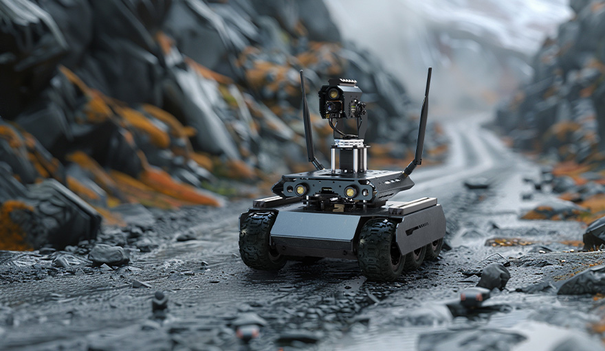

 

  

# Waveshare UGV Robots
This is a lower computer example for the [Waveshare](https://www.waveshare.com/) UGV robots with ROS Driver: **UGV Rover**, **UGV Beast**, **RaspRover**, **UGV02**\*.

\*The old version of UGV02 is driven by General Driver.

## Basic Description
The Waveshare UGV robots utilize both an upper computer and a lower computer. This repository contains the program running on the lower computer, which is typically a ESP32 on **ROS Driver for Robots**.  

The program running on the lower computer is either named [ugv_base_ros](https://github.com/effectsmachine/ugv_base_ros.git) or [ugv_base_general](https://github.com/effectsmachine/ugv_base_general.git) depending on the type of robot driver being used.  

The upper computer communicates with the lower computer (the robot's driver based on ESP32) by sending JSON commands via GPIO UART. The host controller, which employs a [Jetson Orin](https://github.com/waveshareteam/ugv_jetson) or a [Raspberry Pi](https://github.com/waveshareteam/ugv_rpi) based on the type of upper computer being used, handles AI vision and strategy planning, while the sub-controller, utilizing an ESP32, manages motion control and sensor data processing. This setup ensures efficient collaboration and enhanced performance.

## Features
- Closed-loop Speed Control with PID
- Web App Based on ESP32
- IMU
- OLED Screen
- LED Lights(12V switches) Control
- Control via JSON Commands
- Supports Camera PT
- Supports RoArm-M2
- Control and Communicate via ESP-NOW

## Configure the compilation environment
You need to install **[Arduino IDE](https://www.arduino.cc/en/software)** and **[ESP32 Board](https://randomnerdtutorials.com/installing-the-esp32-board-in-arduino-ide-windows-instructions/)** first.

### Install libraries
Copy `SCServo` folder into `C:\Users\[username]\AppData\Local\Arduino15\libraries\`

Install libraries with **`Library Manager`**: ArduinoJson, LittleFS, Adafruit_SSD1306, INA219_WE, ESP32Encoder, PID_v2, SimpleKalmanFilter, Adafruit_ICM20X, Adafruit_ICM20948, Adafruit_Sensor

### Basic Use
You can send JSON command to robot via UART/USB@115200 or Http Request/Web App.

To ensure compatibility with various types of robots. You can configure the robot by entering the following command:

    {"T":900,"main":2,"module":2}

In this command, the s directive denotes a robot-type setting. The first digit, `2`, signifies that the main type of robot is a `UGV Rover`, with `1` representing `RaspRover` and `3` indicating `UGV Beast`. The second digit, `2`, specifies the module as `Camera PT`, where `0` denotes `Nothing` and `1` signifies `RoArm-M2`.

# License
ugv_base_ros for the Waveshare UGV Robots: an open source robotics platform for the ROS Driver for Robots.
Copyright (C) 2024 [Waveshare](https://www.waveshare.com/)

This program is free software: you can redistribute it and/or modify
it under the terms of the GNU General Public License as published by
the Free Software Foundation, either version 3 of the License, or
(at your option) any later version.

This program is distributed in the hope that it will be useful,
but WITHOUT ANY WARRANTY; without even the implied warranty of
MERCHANTABILITY or FITNESS FOR A PARTICULAR PURPOSE.  See the
GNU General Public License for more details.

You should have received a copy of the GNU General Public License
along with this program.  If not, see <http://www.gnu.org/licenses/gpl-3.0.txt>.
